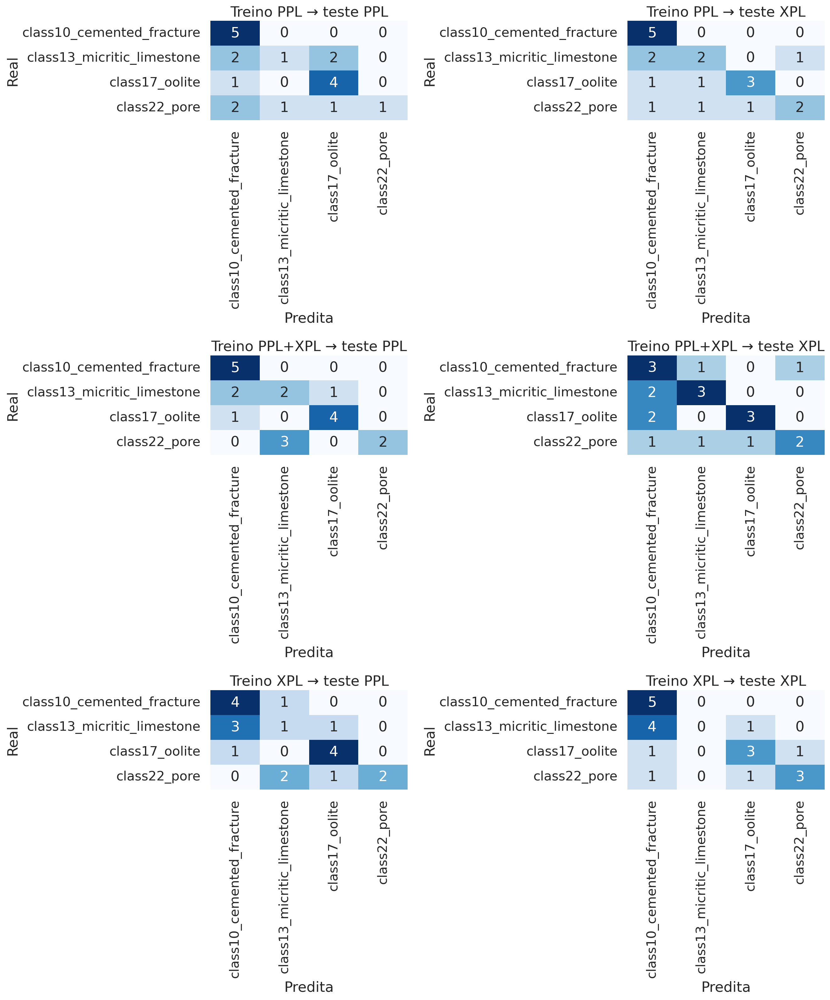
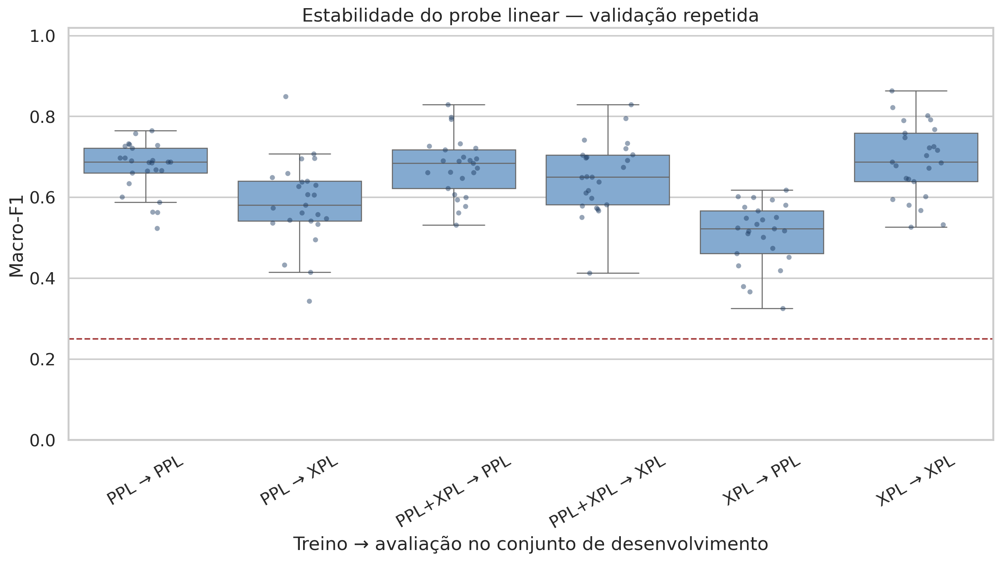
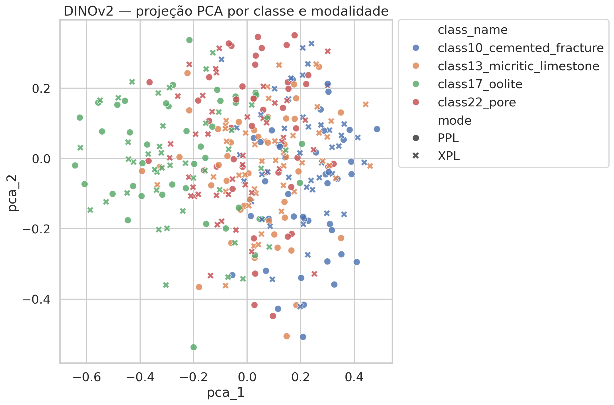
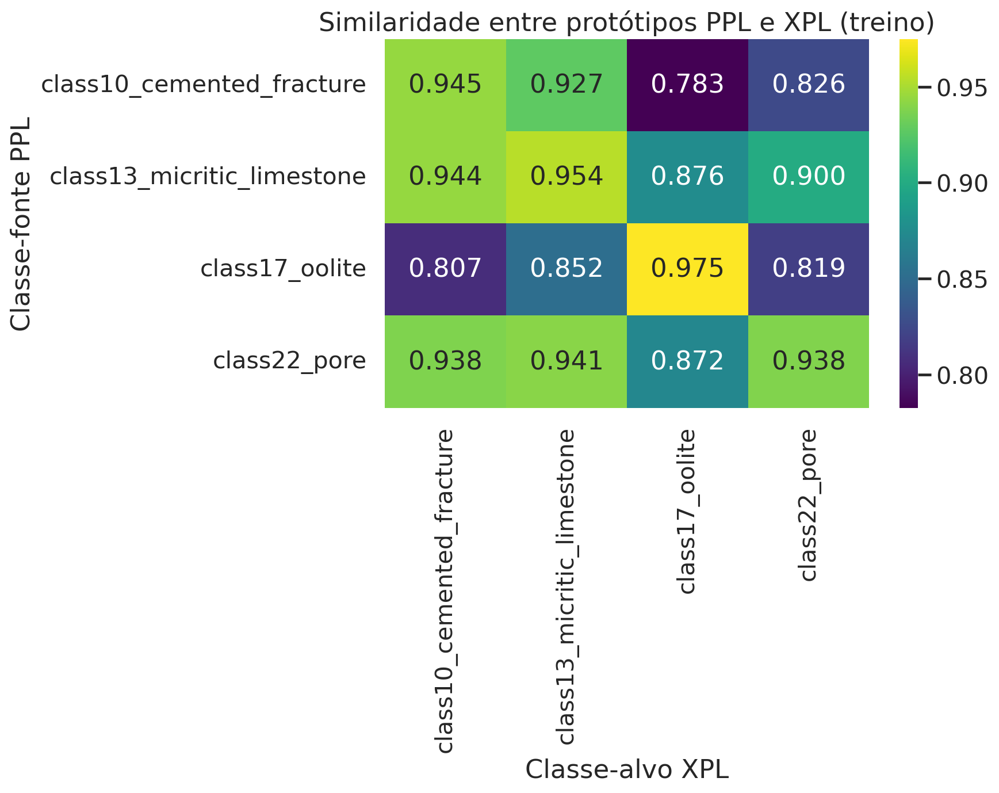

# PetroVision Multimodal - relatório técnico v1.0.0

**Autor:** Rodrigo Rangel Goes e Silva  
**Data:** 3 de setembro de 2026  
**Repositório:** <https://github.com/RangelGS/PetroVision-Multimodal>

## Resumo

O PetroVision Multimodal é uma prova de conceito reproduzível para curadoria e
análise de imagens petrográficas de rochas carbonáticas. O estudo avalia se
representações extraídas de um modelo visual auto-supervisionado preservam
informação útil sobre quatro categorias quando o domínio óptico muda entre luz
plano-polarizada (PPL) e luz polarizada cruzada (XPL). Foram usadas 336 imagens
do DeepCarbonate, equilibradas por classe, modalidade e divisão oficial.

O checkpoint congelado `facebook/dinov2-small` forneceu um vetor CLS
normalizado de 384 dimensões por imagem. Regressão logística, K-Means, PCA e
protótipos médios de classe foram usados como diagnósticos. Além do teste
oficial, uma validação repetida aninhada mediu estabilidade sem reutilizar o
teste para escolher hiperparâmetros. O treinamento combinado PPL+XPL apresentou
o comportamento mais equilibrado, com macro-F1 médio de 0,675 em PPL e 0,650 em
XPL no conjunto de desenvolvimento. Os agrupamentos não supervisionados foram
fracos, o que limita alegações de separação natural entre as categorias.

## 1. Pergunta e escopo

A pergunta central é: representações DINOv2 congeladas conseguem separar as
classes selecionadas e manter utilidade quando a modalidade óptica muda?

O trabalho não treina nem modifica o DINOv2. Também não realiza diagnóstico
geológico, identificação mineral ou validação clínica/industrial. Seu resultado
é um fluxo técnico auditável, do controle de qualidade à análise quantitativa.
Segmentação com SAM 2 permanece fora do escopo validado da v1.0.0.

## 2. Dados e integridade

O recorte usa quatro categorias do DeepCarbonate: Cemented fracture, Micritic
limestone, Oolite e Pore. Cada classe possui 42 imagens PPL e 42 XPL. As
modalidades são tratadas como domínios não pareados porque o arquivo
reorganizado não oferece uma chave individual PPL-XPL confiável.

| Modalidade | Treino | Validação | Teste | Total |
|---|---:|---:|---:|---:|
| PPL | 120 | 28 | 20 | 168 |
| XPL | 120 | 28 | 20 | 168 |
| Total | 240 | 56 | 40 | 336 |

As seguintes garantias foram aplicadas:

- manifesto com origem, tamanho e SHA-256 de cada imagem;
- bloqueio de identificadores ou conteúdos idênticos entre treino, validação e
  teste;
- triagem por pHash, com dez candidatos revisados e mantidos como imagens
  distintas;
- revisão manual dos seis alertas de baixa luminosidade;
- 336 imagens aceitas para modelagem;
- dados brutos mantidos fora do Git e sujeitos à licença da fonte.

## 3. Representação e classificação

Foi usado o checkpoint `facebook/dinov2-small` com revisão fixa. Seus pesos
permaneceram congelados: o projeto aplicou o modelo pré-treinado, mas não
treinou o DINOv2. O token global CLS de 384 dimensões foi normalizado por L2.

Uma regressão logística foi treinada em seis cenários: intra-domínio,
transferência entre domínios e treinamento combinado com avaliação separada em
PPL e XPL. No experimento principal, o hiperparâmetro `C` foi escolhido somente
na validação. O ajuste final usou treino mais validação, e o teste foi consultado
apenas para a avaliação final.

Para descrever estabilidade, foram usadas cinco dobras externas e cinco
repetições, com três dobras internas para selecionar `C`. Isso produz 25
medições por cenário e 150 medições no total, limitadas a treino e validação.
Como as dobras repetidas se sobrepõem, o desvio-padrão é descritivo e não deve
ser interpretado como intervalo de confiança de generalização externa.

## 4. Resultados no teste oficial

O teste oficial contém 20 imagens por modalidade, cinco por classe. Uma pequena
diferença pode corresponder a uma ou duas imagens; por isso, os números devem ser
lidos junto com a análise repetida.

| Treino | Avaliação | Acurácia balanceada | Macro-F1 |
|---|---|---:|---:|
| PPL | PPL | 0,550 | 0,488 |
| PPL | XPL | 0,600 | 0,581 |
| PPL+XPL | PPL | 0,650 | 0,635 |
| PPL+XPL | XPL | 0,550 | 0,557 |
| XPL | PPL | 0,550 | 0,534 |
| XPL | XPL | 0,550 | 0,473 |

O melhor macro-F1 no teste ocorreu no treinamento combinado avaliado em PPL
(0,635). Cemented fracture foi reconhecida de forma consistente, enquanto
Micritic limestone foi uma fonte frequente de confusão. Os seis resultados
ficaram acima do acaso balanceado de 0,25, mas o tamanho do teste impede
comparações finas.

## 5. Estabilidade no conjunto de desenvolvimento

| Treino | Avaliação | Macro-F1 médio ± DP | Mínimo-máximo |
|---|---|---:|---:|
| PPL | PPL | 0,673 ± 0,063 | 0,524-0,765 |
| PPL | XPL | 0,587 ± 0,104 | 0,343-0,850 |
| PPL+XPL | PPL | 0,675 ± 0,073 | 0,531-0,829 |
| PPL+XPL | XPL | 0,650 ± 0,088 | 0,413-0,830 |
| XPL | PPL | 0,509 ± 0,078 | 0,325-0,618 |
| XPL | XPL | 0,691 ± 0,091 | 0,527-0,864 |

O treinamento combinado foi o mais equilibrado: manteve PPL próximo do treino
apenas em PPL e melhorou XPL em relação ao treino apenas em PPL. A transferência
XPL para PPL teve a menor média. PPL para XPL apresentou o maior desvio-padrão,
indicando sensibilidade à composição das dobras.

## 6. Diagnósticos do espaço de embeddings

O K-Means obteve ARI de classe 0,129, NMI de classe 0,186 e silhouette 0,059.
Para modalidade, ARI e NMI foram 0,004 e 0,011. A PCA explica 17,1% da variância
em duas dimensões e mostra sobreposição. Esses valores não sustentam a
existência de grupos naturais fortemente alinhados às classes ou ao modo
óptico.

A similaridade média entre protótipos PPL e XPL da mesma classe foi 0,953,
contra 0,874 entre classes diferentes, um gap de 0,079. Existe alinhamento entre
modalidades, mas as similaridades altas fora da diagonal mostram pequena margem
entre categorias.

## 7. Proveniência

- execução: 3 de setembro de 2026, 22:03 UTC;
- PetroVision: v0.6.1 no commit
  `83ac0b325f81c2f4722593c6df42f196353840de`;
- publicação documental e dos resultados: v1.0.0;
- checkpoint: `facebook/dinov2-small` na revisão
  `ed25f3a31f01632728cabb09d1542f84ab7b0056`;
- ambiente: CUDA em Tesla T4, PyTorch 2.11.0+cu128 e Transformers 5.16.1;
- lote: 16 imagens;
- testes automatizados: 30 aprovados.

O JSON de proveniência preserva as versões, o commit e hashes do manifesto,
configuração, relatório de qualidade e arquivo de embeddings.

## 8. Limitações e conclusão

O recorte contém quatro classes de uma única fonte e apenas cinco imagens de
teste por classe e modalidade. Os rótulos foram herdados e não foram
revalidados por especialista neste projeto. PPL e XPL não são pareados
individualmente, o DINOv2 ficou congelado e as dobras repetidas se sobrepõem.
Não há teste externo de outro laboratório.

As representações DINOv2 contêm sinal útil para classificação linear, e o
treinamento combinado é a alternativa mais equilibrada neste recorte. O
agrupamento fraco e a variação impedem alegações de separação universal. A
contribuição principal é um fluxo reprodutível e auditável, não um diagnóstico
geológico.

## Referências

1. Oquab, M. et al. *DINOv2: Learning Robust Visual Features without
   Supervision*. arXiv:2304.07193, 2023. <https://arxiv.org/abs/2304.07193>
2. Li, K. et al. *A dataset and benchmark of carbonate thin-section images for
   deep learning*. Scientific Data 13, 340, 2026.
   <https://doi.org/10.1038/s41597-026-06633-5>
3. DeepCarbonate. Zenodo. <https://doi.org/10.5281/zenodo.18061204>
